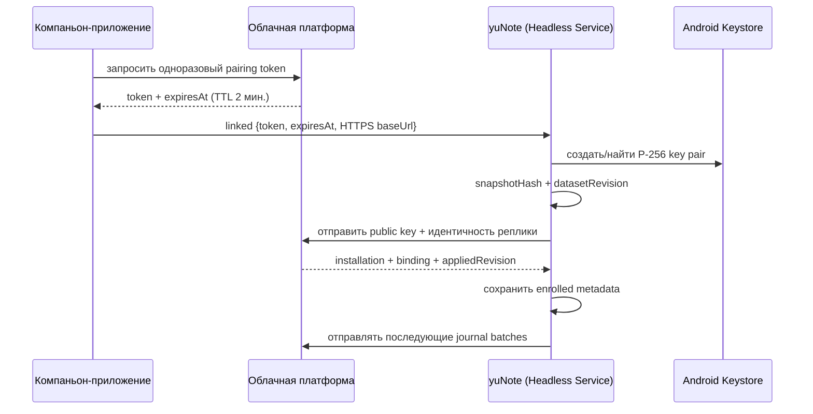

# Локальный транспорт и синхронизация: архитектура и разбор безопасности

**Статус:** показательное описание фактически реализованного и проверенного механизма. Обновлено 25 сентября 2026 года.

## 0. Зачем этот документ

yuNote была написана как самостоятельное offline-first приложение заметок и списков, которое дополнительный компаньон-аппарат («Key Fob») мог бы дистанционно попросить сохранить заметку или изменить список — даже когда экран телефона заблокирован, а UI yuNote не открыт. Чтобы это работало без сети как обязательного посредника и без риска, что произвольное стороннее приложение на телефоне могло бы подделать такое сообщение, пришлось решить две задачи одновременно:

1. Межпроцессная передача действия между двумя независимыми Android-приложениями на одном устройстве, работающая в фоне, при выключенном экране, без участия пользователя.
2. Синхронизация результата в облако, устойчивая к офлайну, с криптографической подписью каждого запроса и без постоянного секрета, который можно было бы перехватить.

Продуктовая часть yuNote (собственно заметки и списки) с тех пор перенесена в компаньон-приложение и там же развивается дальше — так что этот репозиторий больше не активный продукт. Но сама схема безопасной локальной связи между двумя приложениями и подписанной синхронизации осталась рабочей, проверенной на реальном устройстве и, кажется, может быть полезна не только этому проекту — поэтому репозиторий сохранён и публикуется именно ради неё. Ниже — техническое описание того, как это устроено, включая одну реальную найденную и исправленную уязвимость: она интереснее любого абстрактного объяснения того, зачем вообще нужна эта модель угроз.

## 1. Принцип local-first

Любое ручное или полученное извне изменение сначала проходит через одну локальную транзакцию. Успех локальной операции не зависит от сети и не откатывается из-за ошибки облачной синхронизации.

```text
UI или входящее действие от компаньон-приложения
        │
        ▼
runLocalOperation()
        ├── изменить notes/lists/list_items/classes
        ├── сохранить applied_operations
        ├── добавить mutation_journal events
        └── увеличить dataset_state.revision
        │
        ├── вернуть локальный результат/UI
        └── запросить фоновый sync
```

Сеть не участвует в commit локальной операции — она только доставляет уже случившийся результат дальше.

## 2. Границы доверия

Между двумя приложениями и облаком проходят четыре разные границы, и у каждой свой механизм защиты — ни одна не полагается на секрет, который можно скопировать один раз и использовать вечно:

- **Компаньон-приложение → yuNote:** Android permission уровня `signature` и явный bound service — сообщение принимает только процесс, подписанный тем же сертификатом, что и сам компаньон.
- **yuNote → компаньон-приложение** (подтверждения и обратные сообщения): deep link, тоже защищённый `signature`-permission через выделенный `activity-alias`, а не основная запускаемая Activity — см. §3 ниже, почему это разделение и есть суть найденной уязвимости.
- **Компаньон-приложение → облачная платформа:** пользовательская сессия и серверная авторизация — вне периметра этого репозитория.
- **yuNote → облачная платформа:** отдельная installation identity с неэкспортируемым из Android Keystore приватным ключом — см. §7-8.

Текущая локальная граница между двумя приложениями основана на том, что оба APK подписаны одним сертификатом: разрешение уровня `signature`, сервис экспортирован только для обладателя этого разрешения. Это сознательное упрощение для двух приложений одного разработчика — для стороннего экрана понадобился бы отдельный broker/registry и своя модель разрешений, а не общий сертификат на всех.

## 3. Найденная и исправленная уязвимость (2026-09-16)

Это самая содержательная часть модели угроз — не гипотетическая, а реально найденная security review и исправленная.

**Что было не так.** Активность, обслуживающая `LAUNCHER` (то есть экран, которым приложение вообще запускается с иконки), по Android-требованиям обязана быть `exported="true"`. Та же самая Activity изначально принимала входящий deep link `yourapp://transport` через собственный `intent-filter` — но intent-filter не умеет наследовать `android:permission` отдельно от способа запуска Activity, так что deep link оказывался защищён ровно так же, как обычный запуск с иконки: никак. Любое стороннее приложение на устройстве могло отправить `ACTION_VIEW yourapp://transport` с произвольными `kind=sync-push` и `payloadJson`, и это долетало до JS-кода как настоящее сообщение от доверенного отправителя — а обработчик синхронизации затем писал этот payload в реальный аккаунт пользователя через уже авторизованный API-запрос. Разрешение уровня `signature`, которое защищало *исходящий* канал (компаньон → yuNote), никак не помогало входящему deep link — это был отдельный, незащищённый путь в тот же обработчик.

Баг существовал с момента, когда этот relay-канал впервые появился, и был обнаружен только сфокусированным security review уже сильно позже — не как побочный эффект несвязанной работы, а именно потому, что кто-то целенаправленно спросил «а что если это сообщение не от того, от кого мы думаем».

**Как исправлено.** Deep link вынесен на отдельный `activity-alias`, у которого — в отличие от `LAUNCHER`-Activity — нет обязательного требования быть незащищённым: он объявлен с собственным `android:permission` того же уровня `signature`, что и исходящий канал. Основная Activity остаётся exported для `LAUNCHER`, как и должна, но deep link больше не принимает напрямую.

**Как проверено на реальном устройстве.** `adb shell am start` от имени shell UID (не подписанного тем же сертификатом) на новый alias возвращает `SecurityException: Permission Denial`; собственный APK-компаньон при этом подтверждён как `granted=true` на это разрешение (`dumpsys package` на исходном устройстве). То есть проверка — не просто «код похож на правильный», а «конкретная попытка от непривилегированного отправителя реально отклонена, а легитимная реально проходит».

Этот случай — ровно то, ради чего в модели угроз обе границы (входящая и исходящая) описаны отдельно, а не как одна «доверенная пара приложений»: у симметричной на вид задачи (два приложения общаются друг с другом) может быть асимметричная реализация, и слабое место — не там, где его интуитивно ищешь в первую очередь.

## 4. Локальный Android-транспорт

Компаньон-приложение связывается с явным сервисом:

- явный bound service, объявленный с разрешением уровня `signature`;
- механизм: `bindService()` + `Messenger`;
- сообщение: `transferId`, `kind`, опциональный `payloadJson`;
- Headless JS task, поднимаемый через `HeadlessJsTaskService` — независимо от того, открыт ли UI;
- лимит выполнения задачи: 60 секунд.

Поддерживаемые типы локальных сообщений:

- `linked`: обычная связь или безопасный enrollment handoff;
- `unlinked`: удалить локальные полномочия установки;
- `structured-action`: применить намерение;
- `sync-push`, `sync-ack`, `sync-error`: совместимость со старым relay для ещё не зарегистрированных установок.

`processTransportMessage()` открывает мигрированную локальную базу независимо от UI, регистрирует action/sync handlers и обрабатывает сообщение — поэтому основная Activity и экран заметок не требуются для исполнения.

### Проверенные и непроверенные состояния Android

Проверено на реальном устройстве: заблокированный экран, закрытый UI. Не заявлены как поддерживаемые:

- ручной Android Force Stop приложения;
- выполнение до первого разблокирования после перезагрузки;
- поведение при запрете фоновой работы прошивкой/пользователем;
- iOS — архитектура рассчитана на Android background execution model и не переносится по умолчанию.

## 5. Идентичность локального набора данных

`dataset_state` содержит `replica_id`, `generation` и `revision`.

- `replica_id` идентифицирует логический локальный набор данных.
- `generation` меняется при будущей полной замене набора.
- `revision` увеличивается один раз на логическую транзакцию.

`installation_identity` хранит только метаданные привязки и alias ключа. Приватный ключ хранится в Android Keystore и никогда не покидает его.

## 6. Идемпотентная операция

`runLocalOperation()` канонизирует request JSON и проверяет `applied_operations`.

- Новый `operationId` выполняется один раз.
- Повтор с тем же request возвращает сохранённый result/revision.
- Повтор с изменённым request вызывает `OperationPayloadMismatchError`.
- Ошибка в любой части транзакции откатывает данные, журнал и cursor вместе.

Каждая операция обязана создать хотя бы одно journal event. `upsert` содержит payload, `delete` — нет.

## 7. Enrollment



Secure `linked`-сообщение должно содержать одновременно `pairingToken` (64 hex-символа), `pairingExpiresAt` и `cloudBaseUrl` (только HTTPS) — частично заполненный handoff отклоняется.

Pairing token: 256 бит в hex-представлении, предназначен только для одного продукта, связан с текущим пользователем, истекает через 2 минуты, хранится на сервере в виде lookup hash, удаляется в той же транзакции, которая создаёт installation и binding, и не является постоянным ключом синхронизации.

### Безопасный baseline существующих данных

Enrollment передаёт `datasetRevision` и SHA-256 канонического полного локального снимка.

- Если облачная база пуста, сервер создаёт binding с `appliedRevision = 0`.
- Если облачная база не пуста и hash совпадает, binding начинает с локального `datasetRevision`.
- Если hash не совпадает, сервер возвращает конфликт, не расходует токен и не меняет данные.

Это предотвращает наложение revision 1 существующей локальной базы на уже заполненную, но отличающуюся облачную.

## 8. Ключ Android Keystore

Алгоритм: EC `secp256r1`/P-256, подпись `SHA256withECDSA`.

Приватный ключ создаётся Android Keystore, никогда не экспортируется в JavaScript, доступен по проверяемому alias, не требует user authentication для каждой подписи (осознанный компромисс — sync должен работать на заблокированном телефоне; доступ контролируется песочницей приложения и самим Keystore), и удаляется при локальном `unlinked`. Отзыв на сервере остаётся обязательным средством немедленно лишить установку полномочий — удаление локального ключа само по себе не единственная линия защиты.

## 9. Подписанный запрос к облаку

Каждый запрос синхронизации подписывается целиком, включая тело:

```text
<PROTOCOL-NAME>-SIGNED-REQUEST-V1
POST
/installations/journal-batch
<sha256 exact raw body>
<installationId>
<keyVersion>
<timestampMs>
<nonce>
```

Body подписывается в точности в тех байтах, которые отправляются — сервер сверяет сохранённый raw body, а не повторную сериализацию JSON, иначе разное форматирование JSON на разных платформах незаметно ломало бы подпись.

Сервер проверяет: точный формат заголовков; активные installation и binding; совпадение версии ключа; P-256 public key; ECDSA-подпись; отклонение часов не более 5 минут; уникальность nonce (хранится 10 минут); совпадение `replicaId` и `generation` с binding. Неудачная проверка возвращает один и тот же внешний код ошибки независимо от причины — чтобы не подсказывать атакующему, существует ли данный installation ID вообще.

Пакет ограничен по размеру (не более 96 KiB тела), по количеству revisions и events за один запрос; revisions и sequence должны быть строго непрерывны; лишние поля отклоняются. Если первая ожидающая revision сама превышает лимит размера, отправка останавливается локальной ошибкой — revision принципиально не дробится, потому что она уже была одной атомарной транзакцией на телефоне.

Сервер применяет пакет в одной транзакции и различает: точный повтор диапазона (возвращает тот же результат, не переприменяя), тот же диапазон с другим содержимым (отклоняется как конфликт), пропущенную revision, перекрытие уже применённых revisions и отозванный binding. Клиент принимает только ответ, где `ackRevision` точно совпадает с отправленным `toRevision`; курсор сдвигается transactional compare-and-set, а не просто «запрос прошёл без ошибки».

## 10. Планирование синхронизации

Синхронизация запрашивается после: успешной локальной мутации; загрузки приложения; возврата приложения в foreground; успешного headless `structured-action`; завершения enrollment.

Одновременные запросы сериализуются и объединяются — пока один upload выполняется, второй параллельный пакет не создаётся; после успешного пакета координатор продолжает, пока не дойдёт до текущего конца журнала. Сетевая ошибка проглатывается только на границе фонового scheduling: локальная транзакция уже завершена, журнал остаётся неизменным и будет повторён при следующем триггере.

Гарантированного периодического retry через Android WorkManager пока нет — если сеть восстановилась, но новый триггер не возник, доставка может ждать следующего запуска/foreground/действия.

## 11. Legacy relay

До enrollment `flushIfEnrolled()` возвращает false, и клиент использует relay через компаньон-приложение вместо прямой синхронизации. После enrollment мутации идут только по прямому пути. Оба канала не должны одновременно записывать одну и ту же мутацию в одну реплику — это обеспечивает поэтапное обновление установок без гонки между старым и новым путём.

## 12. Unlink

Локальный `unlinked`:

1. удаляет строку `installation_identity`;
2. пытается удалить соответствующий Keystore alias;
3. сохраняет notes/lists/items/classes, dataset state, журнал и applied operations.

Даже если удаление ключа завершилось ошибкой, удалённая metadata прекращает прямой upload, а server-side revocation закрывает полномочия ключа независимо от состояния телефона.

## 13. Что нельзя считать гарантированным

Честно, без приукрашивания:

- Force stop и состояние до первого unlock после перезагрузки не поддерживаются.
- Восстановление сети само по себе не гарантирует немедленный запуск синхронизации — нужен отдельный lifecycle/action trigger.
- Snapshot baseline — не multi-device merge; конфликт нескольких writers одной реплики не разрешается автоматически.
- Cloud-to-local restore («переустановил приложение — верни мне данные из облака») отсутствует.
- Entity payload не шифруется дополнительно поверх HTTPS.
- Production signing key для публичного релиза не настроен — текущие сборки подписаны общим отладочным сертификатом, которым также должно быть подписано доверенное приложение-компаньон (иначе `signature`-permission не совпадёт).

## 14. Проверки

Последняя полная проверка: **31 Jest suite, 174 теста**, `tsc --noEmit` чисто. Ключевые группы:

- `test/data/`: локальные транзакции, идемпотентность, snapshot;
- `test/security/installationKeys.test.ts`: генерация и использование Keystore-ключа;
- `test/sync/`: enrollment, подписанная загрузка журнала, планировщик, legacy outbox;
- `test/relay/`: разбор и применение входящих сообщений, совместимость с legacy relay;
- `test/ui/androidContract.test.ts`, `test/ui/secureTransportContract.test.ts`: контракт с нативной Android-стороной.

Отдельно на физическом Android-устройстве подтверждены: enrollment с заблокированным экраном и закрытым UI; создание заметки в полном офлайне (Wi-Fi и мобильные данные выключены) с последующей доставкой в облако при восстановлении сети; удаление уже синхронизированной заметки; полное совпадение snapshot hash до и после теста (тест не оставил после себя данных); полный расход одноразовых pairing tokens; корректный откат прав и удаление Keystore-ключа при unlink с сохранением заметок.

## 15. Что осталось бы сделать для более широкого использования этой схемы

Текущий код доказывает модель на паре из двух конкретных приложений — это ещё не универсальный SDK для произвольного числа компаньонов:

1. Версионированный общий envelope с `protocolVersion`, sender/recipient, binding, operation и capability.
2. Registry продуктов и разрешённых типов сообщений вместо одной захардкоженной пары.
3. Отдельные очереди, квоты и ключи для каждого продукта.
4. Защищённая передача больших payload через scoped file descriptor/stream, а не путь к файлу.
5. Общие conformance tests для отправителя и получателя, не завязанные на конкретную пару приложений.
6. Политика версионирования, несовместимых изменений и отзыва.
7. Production certificate strategy, не требующая подписывать все участвующие приложения одним общим ключом.

Если что-то из этого пригодится — код и тесты уже показывают рабочую отправную точку, а не только описание на бумаге.
